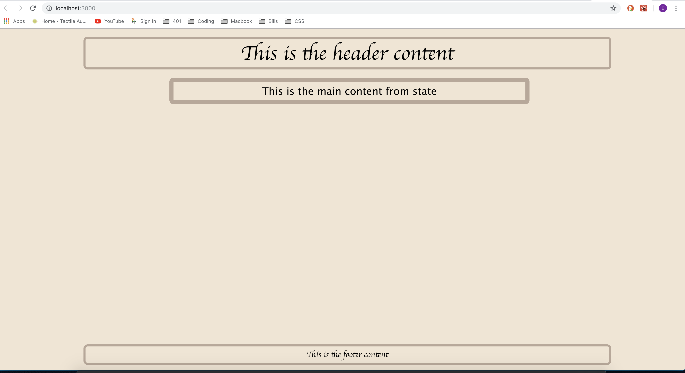

# React-Starter

## Local Setup
* Clone this repo to your local machine and run `npm i`, follow up with an `npm start` from the root directory to see the app in action or just view the beautiful screen shot provided below!

